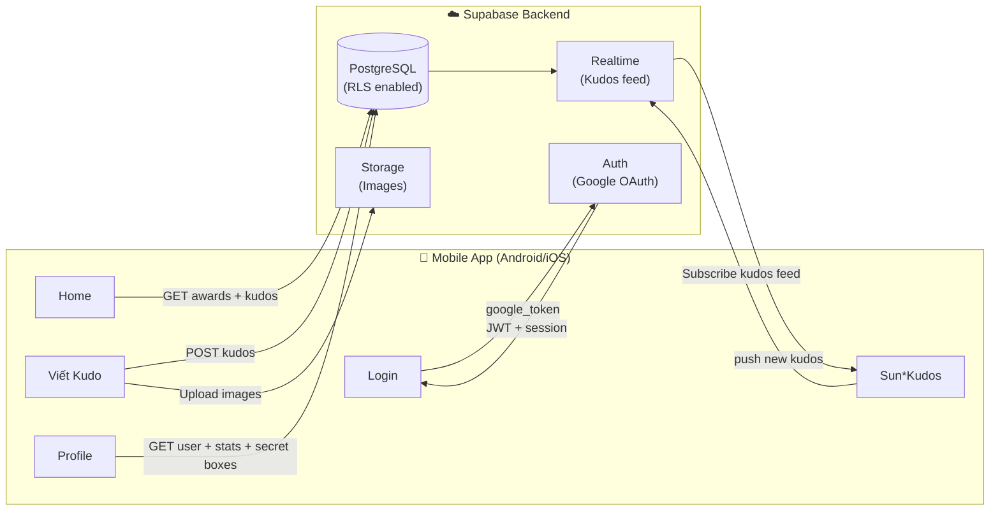

# Screen Flow Overview

## Project Info
- **Project Name**: Sun* Annual Awards (SAA) 2025 — Android Mobile App
- **Figma File Key**: 9ypp4enmFmdK3YAFJLIu6C
- **Figma URL**: https://www.figma.com/design/9ypp4enmFmdK3YAFJLIu6C
- **Platform**: iOS / Android Mobile
- **Created**: 2026-05-05
- **Last Updated**: 2026-05-05

---

## Discovery Progress

| Metric | Count |
|--------|-------|
| Total Screens | 38 |
| Discovered | 38 |
| Spec Done (all items completed) | 14 |
| Spec In Progress (mixed) | 2 |
| Spec Draft (all items draft) | 22 |
| Completion | 100% |

---

## Screens

| # | Screen Name | Screen ID | Spec Status | Group | Navigations To |
|---|-------------|-----------|-------------|-------|----------------|
| 1 | [iOS] Login | `8HGlvYGJWq` | ✅ done | Auth | Home, Language dropdown |
| 2 | [iOS] Language dropdown | `uUvW6Qm1ve` | ✅ done | Auth | Login (đóng dropdown) |
| 3 | [iOS] Access denied | `k-7zJk2B7s` | ✅ done | Error | Home |
| 4 | [iOS] Not Found | `sn2mdavs1a` | ✅ done | Error | Home |
| 5 | [iOS] Home | `OuH1BUTYT0` | ✅ done | Main | Awards, Sun*Kudos, Viết Kudo, Profile, Notifications |
| 6 | [iOS] Award_Top talent | `c-QM3_zjkG` | ✅ done | Awards | Sun*Kudos, Home, Notifications |
| 7 | [iOS] Award_Top project | `FQoJZLkG_d` | ✅ done | Awards | Sun*Kudos, Home |
| 8 | [iOS] Award_Top project leader | `QQvsfK3yaK` | ✅ done | Awards | Sun*Kudos, Home |
| 9 | [iOS] Award_Best Manager | `7y195PPTxQ` | ✅ done | Awards | Sun*Kudos, Home |
| 10 | [iOS] Award_Signature 2025 - Creator | `O98TwiHaJe` | ✅ done | Awards | Sun*Kudos, Home |
| 11 | [iOS] Award_MVP | `b2BuS8HYIt` | ✅ done | Awards | Sun*Kudos, Home |
| 12 | [iOS] Sun*Kudos | `fO0Kt19sZZ` | ⚠️ in progress | Kudos | Viết Kudo, All Kudos, View kudo, Dropdown hashtag, Dropdown phòng ban, Open secret box, Search Sunner |
| 13 | [iOS] Sun*Kudos_All Kudos | `j_a2GQWKDJ` | 🔲 draft | Kudos | View kudo, Dropdown hashtag, Dropdown phòng ban |
| 14 | [iOS] Sun*Kudos_Viết Kudo_default | `7fFAb-K35a` | ✅ done | Kudos | Sun*Kudos, Dropdown hashtag, Dropdown người nhận, Tiêu chuẩn cộng đồng |
| 15 | [iOS] Sun*Kudos_Gửi lời chúc Kudos | `PV7jBVZU1N` | 🔲 draft | Kudos | Sun*Kudos, Dropdown hashtag, Dropdown người nhận |
| 16 | [iOS] Sun*Kudos_Lỗi chưa điền hết | `0le8xKnFE_` | 🔲 draft | Kudos | Viết Kudo (hiển thị lỗi) |
| 17 | [iOS] Sun*Kudos_Search Sunner | `3jgwke3E8O` | ✅ done | Kudos | Searching, Profile người khác |
| 18 | [iOS] Sun*Kudos_Searching | `hldqjHoSRH` | ✅ done | Kudos | Profile người khác, Search Sunner (back) |
| 19 | [iOS] Sun*Kudos_View kudo | `T0TR16k0vH` | ✅ done | Kudos | Sun*Kudos (back), Profile người khác |
| 20 | [iOS] Sun*Kudos_View kudo ẩn danh | `5C2BL6GYXL` | 🔲 draft | Kudos | Sun*Kudos (back) |
| 21 | [iOS] Sun*Kudos_Tiêu chuẩn cộng đồng | `xms7csmDhD` | ✅ done | Kudos | Viết Kudo (back) |
| 22 | [iOS] Sun*Kudos_dropdown hashtag | `V5GRjAdJyb` | 🔲 draft | Overlay | Sun*Kudos (đóng dropdown) |
| 23 | [iOS] Sun*Kudos_dropdown phòng ban | `76k69LQPfj` | 🔲 draft | Overlay | Sun*Kudos (đóng dropdown) |
| 24 | [iOS] Sun*Kudos_Gửi lời chúc Kudos_dropdown hashtag | `aKWA2klsnt` | 🔲 draft | Overlay | Viết Kudo (đóng dropdown) |
| 25 | [iOS] Sun*Kudos_Gửi lời chúc Kudos_dropdown tên người nhận | `5MU728Tjck` | 🔲 draft | Overlay | Viết Kudo (đóng dropdown) |
| 26 | [iOS] Open secret box | `kQk65hSYF2` | 🔲 draft | Feature | — (action bấm mở) |
| 27 | [iOS] Open secret box- action bấm mở | `KUmv414uC9` | 🔲 draft | Feature | Open secret box (standby) |
| 28 | [iOS] Open secret box- trạng thái Standby (1) | `-LIblaeusT` | 🔲 draft | Feature | — |
| 29 | [iOS] Open secret box- trạng thái Standby (2) | `IXpGakYRm5` | 🔲 draft | Feature | — |
| 30 | [iOS] Open secret box- trạng thái Standby (3) | `_cWAEarZPi` | 🔲 draft | Feature | — |
| 31 | [iOS] Open secret box- trạng thái Standby (4) | `scvV-OQCAJ` | 🔲 draft | Feature | — |
| 32 | [iOS] Open secret box- trạng thái Standby (5) | `wsI6gaO_yc` | 🔲 draft | Feature | — |
| 33 | [iOS] Open secret box- trạng thái Standby (6) | `FvTOS7oCPU` | 🔲 draft | Feature | — |
| 34 | [iOS] Open secret box- trạng thái Standby (7) | `xptNUunBS_` | 🔲 draft | Feature | — |
| 35 | [iOS] Notifications | `_b68CBWKl5` | ✅ done | Feature | View kudo, Home (back) |
| 36 | [iOS] Profile bản thân | `hSH7L8doXB` | ⚠️ in progress | Profile | Open secret box, View kudo, Viết Kudo |
| 37 | [iOS] Profile người khác | `bEpdheM0yU` | 🔲 draft | Profile | View kudo, Viết Kudo |
| 38 | [iOS] Thể lệ | `zIuFaHAid4` | ✅ done | Feature | Home (back) |

---

## Navigation Graph

```mermaid
flowchart TD
    subgraph Auth["🔐 Xác thực"]
        Login["[iOS] Login"]
        LangDrop["[iOS] Language\ndropdown"]
    end

    subgraph Error["⚠️ Lỗi"]
        AccessDenied["[iOS] Access denied\n(403)"]
        NotFound["[iOS] Not Found\n(404)"]
    end

    subgraph TabMain["🏠 Bottom Tab Bar"]
        Home["[iOS] Home\n(Tab: SAA)"]

        subgraph AwardTab["Tab: Awards"]
            AT["Award_Top talent"]
            AP["Award_Top project"]
            APL["Award_Top project leader"]
            ABM["Award_Best Manager"]
            AS25["Award_Signature 2025"]
            AMVP["Award_MVP"]
        end

        subgraph KudosTab["Tab: Kudos"]
            KudosHome["[iOS] Sun*Kudos\n(Main Feed)"]
            AllKudos["Sun*Kudos\n_All Kudos"]
            WriteKudo["Sun*Kudos\n_Viết Kudo_default"]
            WriteKudo2["Sun*Kudos\n_Gửi lời chúc Kudos"]
            WriteError["Sun*Kudos\n_Lỗi chưa điền hết"]
            ViewKudo["Sun*Kudos\n_View kudo"]
            ViewKudoAnon["Sun*Kudos\n_View kudo ẩn danh"]
            SearchSunner["Sun*Kudos\n_Search Sunner"]
            Searching["Sun*Kudos\n_Searching"]
            Community["Sun*Kudos\n_Tiêu chuẩn cộng đồng"]
        end

        subgraph ProfileTab["Tab: Profile"]
            ProfileOwn["[iOS] Profile\nbản thân"]
            ProfileOther["[iOS] Profile\nngười khác"]
        end
    end

    subgraph Overlays["📋 Overlays / Dropdowns"]
        DropHashtag["Dropdown hashtag\n(Feed filter)"]
        DropDept["Dropdown phòng ban\n(Feed filter)"]
        DropWriteHashtag["Dropdown hashtag\n(Viết Kudo)"]
        DropRecipient["Dropdown tên\nngười nhận"]
    end

    subgraph Features["⚙️ Tính năng"]
        Notif["[iOS] Notifications"]
        SecretBox["[iOS] Open\nsecret box"]
        SecretBoxAction["Open secret box\n- action bấm mở"]
        SecretBoxStandby["Open secret box\n- Standby ×7"]
        Rules["[iOS] Thể lệ"]
    end

    %% Auth
    Login -->|"Google OAuth ✅"| Home
    Login -->|"Domain sai ❌"| AccessDenied
    Login -->|"Click language"| LangDrop
    LangDrop -->|"Chọn VN / EN / JA"| Login
    AccessDenied -->|"Go back to Home"| Home
    NotFound -->|"Go back to Home"| Home

    %% Language global (header trên mọi main screen)
    Home -->|"Click language"| LangDrop
    LangDrop -->|"Chọn ngôn ngữ"| Home

    %% Home → features
    Home -->|"Tab: Awards"| AT
    Home -->|"Tab: Kudos"| KudosHome
    Home -->|"Tab: Profile"| ProfileOwn
    Home -->|"Click 🔔 bell"| Notif
    Home -->|"Click 'ABOUT KUDOS'"| KudosHome
    Home -->|"FAB pen → Viết Kudo"| WriteKudo
    Home -->|"Click 'Thể lệ'"| Rules

    %% Awards tab — swipe / menu nội bộ
    AT <-->|"Swipe / Menu"| AP
    AP <-->|"Swipe / Menu"| APL
    APL <-->|"Swipe / Menu"| ABM
    ABM <-->|"Swipe / Menu"| AS25
    AS25 <-->|"Swipe / Menu"| AMVP
    AT -->|"Tab: Kudos"| KudosHome
    AP -->|"Tab: Kudos"| KudosHome
    APL -->|"Tab: Kudos"| KudosHome
    ABM -->|"Tab: Kudos"| KudosHome
    AS25 -->|"Tab: Kudos"| KudosHome
    AMVP -->|"Tab: Kudos"| KudosHome

    %% Sun*Kudos main feed
    KudosHome -->|"Click 'Tất cả Kudos'"| AllKudos
    KudosHome -->|"FAB / 'Viết Kudo'"| WriteKudo
    KudosHome -->|"Tap kudo card"| ViewKudo
    KudosHome -->|"Tap kudo ẩn danh"| ViewKudoAnon
    KudosHome -->|"Click filter hashtag"| DropHashtag
    KudosHome -->|"Click filter phòng ban"| DropDept
    KudosHome -->|"Click 'Mở quà'"| SecretBox
    KudosHome -->|"Click search icon"| SearchSunner
    DropHashtag -->|"Chọn hashtag"| KudosHome
    DropDept -->|"Chọn phòng ban"| KudosHome

    AllKudos -->|"Tap kudo card"| ViewKudo
    AllKudos -->|"Click filter hashtag"| DropHashtag
    AllKudos -->|"Click filter phòng ban"| DropDept

    %% Write Kudo flow
    WriteKudo -->|"Search người nhận"| DropRecipient
    WriteKudo -->|"Chọn hashtag"| DropWriteHashtag
    WriteKudo -->|"Click 'Tiêu chuẩn cộng đồng'"| Community
    WriteKudo -->|"Submit thiếu field"| WriteError
    WriteKudo -->|"Click 'Gửi đi' ✅"| KudosHome
    WriteKudo -->|"Click 'Huỷ'"| KudosHome
    WriteKudo2 -->|"Click 'Gửi đi' ✅"| KudosHome
    WriteKudo2 -->|"Click 'Huỷ'"| KudosHome
    DropRecipient -->|"Chọn người nhận"| WriteKudo
    DropWriteHashtag -->|"Chọn hashtag"| WriteKudo
    WriteError -->|"Sửa & thử lại"| WriteKudo
    Community -->|"Back"| WriteKudo

    %% Search Sunner
    SearchSunner -->|"Nhập từ khoá"| Searching
    SearchSunner -->|"Tap item gần đây"| ProfileOther
    Searching -->|"Tap kết quả"| ProfileOther
    Searching -->|"Back"| SearchSunner

    %% View Kudo
    ViewKudo -->|"Back"| KudosHome
    ViewKudo -->|"Tap avatar"| ProfileOther
    ViewKudoAnon -->|"Back"| KudosHome

    %% Profile
    ProfileOwn -->|"Click secret box"| SecretBox
    ProfileOwn -->|"Tap kudo card"| ViewKudo
    ProfileOwn -->|"Tab: Kudos"| KudosHome
    ProfileOther -->|"Tab: Kudos"| KudosHome
    ProfileOther -->|"Tap kudo card"| ViewKudo

    %% Notifications
    Notif -->|"Tap kudo notification"| ViewKudo
    Notif -->|"Back"| Home

    %% Secret Box
    SecretBox -->|"Click 'Mở'"| SecretBoxAction
    SecretBoxAction -->|"Đang mở → standby"| SecretBoxStandby
    SecretBox -->|"Back"| ProfileOwn

    %% Rules
    Rules -->|"Back"| Home
```

---

## Screen Groups

### Group: Authentication & Error

| Screen | Screen ID | Spec | Mục đích | Entry Points |
|--------|-----------|------|---------|--------------|
| [iOS] Login | `8HGlvYGJWq` | ✅ done | Đăng nhập Google OAuth | App launch, Token hết hạn (401) |
| [iOS] Language dropdown | `uUvW6Qm1ve` | ✅ done | Chọn ngôn ngữ VN / EN / JA | Login, Header mọi main screen |
| [iOS] Access denied | `k-7zJk2B7s` | ✅ done | Lỗi 403 — không có quyền | Login thất bại (domain sai) |
| [iOS] Not Found | `sn2mdavs1a` | ✅ done | Lỗi 404 — URL không tồn tại | Điều hướng URL không hợp lệ |

### Group: Main (Tab Bar)

| Screen | Screen ID | Spec | Mục đích | Tab |
|--------|-----------|------|---------|-----|
| [iOS] Home | `OuH1BUTYT0` | ✅ done | Trang chủ — countdown, awards highlights, kudos section | SAA |
| [iOS] Award_Top talent | `c-QM3_zjkG` | ✅ done | Chi tiết giải Top Talent | Awards |
| [iOS] Award_Top project | `FQoJZLkG_d` | ✅ done | Chi tiết giải Top Project | Awards |
| [iOS] Award_Top project leader | `QQvsfK3yaK` | ✅ done | Chi tiết giải Top Project Leader | Awards |
| [iOS] Award_Best Manager | `7y195PPTxQ` | ✅ done | Chi tiết giải Best Manager | Awards |
| [iOS] Award_Signature 2025 - Creator | `O98TwiHaJe` | ✅ done | Chi tiết giải Signature 2025 | Awards |
| [iOS] Award_MVP | `b2BuS8HYIt` | ✅ done | Chi tiết giải MVP | Awards |
| [iOS] Profile bản thân | `hSH7L8doXB` | ⚠️ in progress | Trang cá nhân — stats, bộ sưu tập icon, kudos | Profile |

### Group: Kudos (Tab: Kudos)

| Screen | Screen ID | Spec | Mục đích | Entry Points |
|--------|-----------|------|---------|--------------|
| [iOS] Sun*Kudos | `fO0Kt19sZZ` | ⚠️ in progress | Feed kudos highlight + spotlight board, filter phòng ban/hashtag | Tab bar, Home |
| [iOS] Sun*Kudos_All Kudos | `j_a2GQWKDJ` | 🔲 draft | Tất cả kudos dạng list, có filter | Sun*Kudos |
| [iOS] Sun*Kudos_Viết Kudo_default | `7fFAb-K35a` | ✅ done | Form viết & gửi kudo mới | Home FAB, Sun*Kudos FAB |
| [iOS] Sun*Kudos_Gửi lời chúc Kudos | `PV7jBVZU1N` | 🔲 draft | Dạng modal gửi lời chúc | Sun*Kudos |
| [iOS] Sun*Kudos_Lỗi chưa điền hết | `0le8xKnFE_` | 🔲 draft | Trạng thái validation lỗi trên form viết kudo | Viết Kudo (submit thiếu field) |
| [iOS] Sun*Kudos_Search Sunner | `3jgwke3E8O` | ✅ done | Tìm kiếm Sunner — trạng thái default (chưa nhập) | Viết Kudo, Search icon |
| [iOS] Sun*Kudos_Searching | `hldqjHoSRH` | ✅ done | Kết quả tìm kiếm realtime (đang nhập) | Search Sunner |
| [iOS] Sun*Kudos_View kudo | `T0TR16k0vH` | ✅ done | Chi tiết một kudo card | Sun*Kudos, All Kudos |
| [iOS] Sun*Kudos_View kudo ẩn danh | `5C2BL6GYXL` | 🔲 draft | Chi tiết kudo từ người ẩn danh | Sun*Kudos, All Kudos |
| [iOS] Sun*Kudos_Tiêu chuẩn cộng đồng | `xms7csmDhD` | ✅ done | Tiêu chuẩn cộng đồng & bảo mật khi viết kudos | Viết Kudo |

### Group: Overlays / Dropdowns

| Screen | Screen ID | Spec | Mục đích | Triggered From |
|--------|-----------|------|---------|----------------|
| [iOS] Sun*Kudos_dropdown hashtag | `V5GRjAdJyb` | 🔲 draft | Lọc feed kudos theo hashtag | Sun*Kudos, All Kudos |
| [iOS] Sun*Kudos_dropdown phòng ban | `76k69LQPfj` | 🔲 draft | Lọc feed kudos theo phòng ban | Sun*Kudos, All Kudos |
| [iOS] Sun*Kudos_Gửi Kudos_dropdown hashtag | `aKWA2klsnt` | 🔲 draft | Chọn hashtag khi viết kudo | Viết Kudo |
| [iOS] Sun*Kudos_Gửi Kudos_dropdown tên người nhận | `5MU728Tjck` | 🔲 draft | Chọn người nhận khi viết kudo | Viết Kudo |

### Group: Profile

| Screen | Screen ID | Spec | Mục đích | Entry Points |
|--------|-----------|------|---------|--------------|
| [iOS] Profile bản thân | `hSH7L8doXB` | ⚠️ in progress | Trang cá nhân — kudos đã gửi/nhận, huy hiệu, secret box, thống kê | Tab bar: Profile |
| [iOS] Profile người khác | `bEpdheM0yU` | 🔲 draft | Xem profile của Sunner khác | View kudo, Search Sunner |

### Group: Tính năng đặc biệt

| Screen | Screen ID | Spec | Mục đích | Entry Points |
|--------|-----------|------|---------|--------------|
| [iOS] Notifications | `_b68CBWKl5` | ✅ done | Danh sách thông báo (kudo mới, like) — đánh dấu đã đọc | Header bell icon |
| [iOS] Open secret box | `kQk65hSYF2` | 🔲 draft | Xem hộp quà bí ẩn chưa mở, số lượng còn lại | Profile bản thân, Notification |
| [iOS] Open secret box- action bấm mở | `KUmv414uC9` | 🔲 draft | Trạng thái khi đang bấm mở hộp quà | Open secret box |
| [iOS] Open secret box- Standby (×7) | `-LIblaeusT` ... `xptNUunBS_` | 🔲 draft | 7 animation frames standby sau khi mở hộp | Open secret box action |
| [iOS] Thể lệ | `zIuFaHAid4` | ✅ done | Nội dung thể lệ chương trình SAA 2025 | Home, Sun*Kudos |

---

## API Endpoints Summary

| Endpoint | Method | Screens Using | Mục đích |
|----------|--------|---------------|---------|
| `POST /auth/google` | POST | Login | Xác thực Google OAuth |
| `GET /awards` | GET | Home, Award screens | Danh sách hạng mục giải thưởng SAA 2025 |
| `GET /awards/:category` | GET | Award_* | Chi tiết từng hạng mục (Top Talent, MVP...) |
| `GET /kudos` | GET | Home, Sun*Kudos, All Kudos | Feed kudos (hỗ trợ filter hashtag, phòng ban) |
| `GET /kudos/:id` | GET | View kudo, View kudo ẩn danh | Chi tiết một kudo |
| `POST /kudos` | POST | Viết Kudo | Tạo kudo mới |
| `POST /kudos/:id/like` | POST | View kudo, Sun*Kudos | Like / unlike kudo |
| `GET /hashtags` | GET | Dropdown hashtag, Viết Kudo | Danh sách hashtag |
| `GET /departments` | GET | Dropdown phòng ban | Danh sách phòng ban |
| `GET /users?search=` | GET | Search Sunner, Searching | Tìm kiếm Sunner theo tên / email |
| `GET /users/:id` | GET | Profile người khác | Thông tin profile Sunner |
| `GET /users/me` | GET | Profile bản thân | Thông tin cá nhân |
| `GET /users/me/kudos` | GET | Profile bản thân | Kudos đã gửi / nhận |
| `GET /notifications` | GET | Notifications | Danh sách thông báo |
| `POST /notifications/read-all` | POST | Notifications | Đánh dấu đọc tất cả |
| `GET /secret-boxes` | GET | Open secret box, Profile | Danh sách secret box của user |
| `POST /secret-boxes/:id/open` | POST | Open secret box action | Mở một secret box |
| `GET /rules` | GET | Thể lệ | Nội dung thể lệ SAA 2025 |
| `GET /community-standards` | GET | Tiêu chuẩn cộng đồng | Quy tắc viết kudos + tiêu chuẩn bảo mật |

---

## Data Flow

---

## Technical Notes

### Bottom Navigation (4 tabs)
| Tab | Label | Màn hình chính |
|-----|-------|---------------|
| 1 | SAA | [iOS] Home |
| 2 | Awards | [iOS] Award_Top talent (+ 5 awards khác, swipe/menu) |
| 3 | Kudos | [iOS] Sun*Kudos |
| 4 | Profile | [iOS] Profile bản thân |

### Authentication
- Google OAuth qua Supabase Auth
- Token lưu trong `EncryptedSharedPreferences` (Android)
- Tự động redirect về Login khi token hết hạn (401)
- Access denied (403) khi email không thuộc `@sun-asterisk.com`

### Localization
- 3 ngôn ngữ: 🇻🇳 Tiếng Việt · 🇬🇧 Tiếng Anh · 🇯🇵 Tiếng Nhật
- Language dropdown có trên Login và Header của mọi màn hình main

### Write Kudo — Validation Rules
- **Người nhận**: bắt buộc (search dropdown, `GET /users?search=`)
- **Hashtag**: bắt buộc (chọn từ danh sách)
- **Nội dung**: bắt buộc, có giới hạn ký tự
- **Ảnh đính kèm**: tùy chọn
- **Gửi ẩn danh**: checkbox tùy chọn

### Sun*Kudos — Realtime
- Feed cập nhật realtime qua Supabase Realtime subscription
- Kudo mới được push lên đầu feed không cần reload

### Open Secret Box
- 7 frames Standby biểu diễn các animation state khi hộp quà đang được mở
- Số lượng secret box chưa mở hiển thị tại Profile bản thân

---

## Discovery Log

| Timestamp | Action | Detail |
|-----------|--------|--------|
| 2026-05-05 | Frame list fetched | `list_frames` — file `9ypp4enmFmdK3YAFJLIu6C`, tổng 178 frames |
| 2026-05-05 | Mobile screens filtered | 38 màn hình prefix `[iOS]` |
| 2026-05-05 | Node trees & design items analyzed | Login, Language dropdown, Access denied, Not Found, Home, Sun*Kudos, Viết Kudo, View kudo, Search Sunner, Searching, Tiêu chuẩn cộng đồng, Profile bản thân, Notifications, Thể lệ, Open secret box, All awards (×6) |
| 2026-05-05 | Spec status evaluated | 14 done · 2 in progress · 22 draft |
| 2026-05-05 | SCREENFLOW.md created | 38 màn hình, navigation graph, API mapping |
